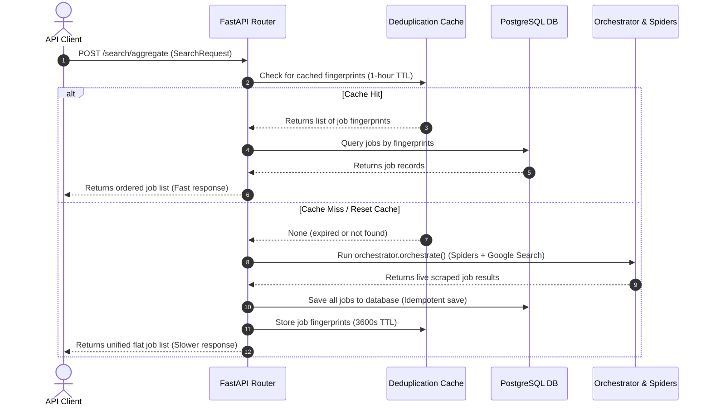

# Job Board Scraping & Aggregation Engine — API Reference

This document provides a detailed reference for all API endpoints exposed by the **Job Board Scraping & Aggregation Engine**. 

---

## Interactive Documentation (Swagger UI)

When the backend container is running, the interactive OpenAPI specification and Swagger UI are accessible at:
* **Swagger UI:** [http://localhost:8000/docs](http://localhost:8000/docs)
* **ReDoc:** [http://localhost:8000/redoc](http://localhost:8000/redoc)

All request parameters, validation rules, examples, and response schemas are declared natively via Pydantic v2 metadata and are automatically rendered by the Swagger interface.

---

## Search & Aggregation Flow

The following sequence illustrates the caching and database-retrieval pipeline executed when `/search/aggregate` is called:



---

## API Endpoints Reference

### 1. Unified Aggregate Search
* **Endpoint:** `POST /search/aggregate`
* **Summary:** Flat Aggregated Search with 1-Hour Database Cache.
* **Description:** Unified endpoint fetching from LinkedIn, Indeed, and Google. Live-scraped results are saved to the PostgreSQL database and cached for 1 hour. Subsequent matching requests load directly from the database for sub-second performance.

#### Request Body (`SearchRequest`)
```json
{
  "keywords": ["backend", "fastapi", "python"],
  "job_sites": ["linkedin.com/jobs", "greenhouse.io"],
  "work_type": "remote",
  "location": "remote",
  "countries": ["egypt", "Germany"],
  "max_results": 50,
  "days_back": 3,
  "reset_cache": false
}
```

#### Response (`list[JobResult]`)
```json
[
  {
    "id": "2d1bc023de6143c08ec2027e1f7c5e2d",
    "title": "Senior Python Developer",
    "company": "Tech Innovators",
    "url": "https://www.linkedin.com/jobs/view/123456789",
    "description": "Looking for a seasoned backend engineer experienced in FastAPI...",
    "location": "Remote, Egypt",
    "salary": "$80,000 - $100,000 / year",
    "source": "linkedin",
    "dork_query": "",
    "posted_at": "24 hours ago",
    "score": 9.2
  }
]
```

---

### 2. Google Dork Search
* **Endpoint:** `POST /search`
* **Summary:** Google Dork Job Search.
* **Description:** Executes template-based Google Search dorks (using Serper.dev / SerpApi fallback) targeting specific ATS domains like Greenhouse, Lever, Ashby, and Workable.

#### Request Body (`SearchRequest`)
Similar to aggregate search.

#### Response (`SearchResponse`)
```json
{
  "jobs": [
    {
      "id": "e98e4d3a9b1c4e5b6a7c8d9e0f1a2b3c",
      "title": "FastAPI Architect",
      "company": "Modern Web Corp",
      "url": "https://jobs.lever.co/modernweb/12345",
      "description": "Design and scaling of FastAPI backend microservices...",
      "location": "Remote (US/Canada)",
      "salary": "N/A",
      "source": "lever",
      "dork_query": "site:lever.co \"FastAPI Architect\" \"remote\"",
      "posted_at": "3 days ago",
      "score": 8.5
    }
  ],
  "total_found": 15,
  "new_jobs": 2,
  "cached_skipped": 13,
  "recency_skipped": 0,
  "queries_run": 3,
  "duration_ms": 2100,
  "timestamp": "2026-06-02T17:59:20Z"
}
```

---

### 3. Orchestrated Live Scrapers
* **Endpoint:** `POST /search/orchestrate`
* **Summary:** Orchestrate Spiders & Google Search.
* **Description:** Runs concurrent, country-specific Playwright spiders (e.g. `linkedin_eg`, `indeed_sa`) and Google Search dorks in parallel, returning results nested by crawler source.

#### Response Schema (`dict[str, list[dict]]`)
```json
{
  "linkedin": [
    {
      "title": "Systems Engineer",
      "company": "Global Corp",
      "url": "https://www.linkedin.com/jobs/view/999",
      "description": "Kubernetes and AWS backend automation...",
      "location": "Cairo, Egypt",
      "salary": "N/A"
    }
  ],
  "indeed": [],
  "google": []
}
```

---

### 4. Legacy JobSpy Router
* **Endpoint:** `POST /search/jobspy`
* **Summary:** Legacy JobSpy Search Compatibility Route.
* **Description:** Backward-compatibility route serving flat results specifically from LinkedIn and Indeed. Bypasses general Google search results.

---

### 5. Dork Query Preview
* **Endpoint:** `GET /queries/preview`
* **Summary:** Preview Query Dorks.
* **Description:** Builds and displays the raw list of Google Search Dork queries that would be run for given criteria, without executing them. Great for dry-testing search scopes.

#### Query Parameters
* `keywords` (str): Comma-separated search terms. (Default: `"devops,kubernetes,terraform"`)
* `sites` (str): Comma-separated domains to search. (Default: `"linkedin.com/jobs,weworkremotely.com,greenhouse.io,lever.co"`)
* `location` (str): Onsite location or remote filter. (Default: `"remote"`)
* `countries` (str): Target countries. (Default: `"egypt,mena,eu,usa,canada"`)
* `days_back` (int): Number of days back. (Default: `1`)

#### Response
```json
{
  "queries": [
    "site:linkedin.com/jobs \"devops\" \"remote\" after:2026-06-01",
    "site:weworkremotely.com \"devops\" after:2026-06-01"
  ],
  "count": 2
}
```

---

### 6. Batch Google Search
* **Endpoint:** `POST /batch-search`
* **Summary:** Batch Google Search.
* **Description:** Runs raw list of custom Google search queries in parallel, parses, and returns the unified list of job items.

---

### 7. Cache Management
* **DELETE `/cache`**: Flushes all cached query fingerprints and URL deduplication history from the Redis or in-memory cache.
* **GET `/cache/stats`**: Returns statistics such as the count of tracked URLs and the oldest timestamp.

---

## Detailed Use Cases: Remote vs Onsite Jobs

The job scraping engine adapts its routing and search dork templates based on whether the query represents a **Remote** or **Onsite** job search.

### Use Case A: Remote Jobs (Global/Virtual)
To search for virtual remote roles, configure the `SearchRequest` with `work_type="remote"` and `location="remote"`. 

> [!NOTE]
> When `work_type="remote"` is specified, the orchestrator spawns **all** available regional spiders (e.g. Egypt, Saudi Arabia, UAE, Germany, Poland, Spain, Canada) to fetch international remote opportunities, and configures the Google Search dork templates with the `"remote"` keyword.

#### Request Example
```json
{
  "keywords": ["DevOps", "Kubernetes", "Golang"],
  "work_type": "remote",
  "location": "remote",
  "countries": ["egypt", "Germany", "usa"],
  "days_back": 3,
  "max_results": 40
}
```

---

### Use Case B: Onsite Jobs (Location-Specific)
To search for physical jobs in a specific city/country, configure `work_type="onsite"` (or `None`), provide the target `location` name, and specify the primary country in `countries`.

> [!IMPORTANT]
> The engine optimizes resource usage by routing the request **only** to regional spiders matching the target location and country.
> For example:
> * If location is `"Cairo"` and country is `"egypt"`, the orchestrator executes **only** `linkedin_eg` and `indeed_eg`.
> * If location is `"Riyadh"` and country is `"saudi"`, the orchestrator executes **only** `linkedin_sa` and `indeed_sa`.
> * Other regional spiders are ignored.
> * The Google Search templates will scope the location keywords (e.g., `"Cairo"`) instead of `"remote"`.

#### Request Example (Onsite Cairo, Egypt)
```json
{
  "keywords": ["Python", "FastAPI"],
  "work_type": "onsite",
  "location": "Cairo",
  "countries": ["egypt"],
  "days_back": 7,
  "max_results": 20
}
```
