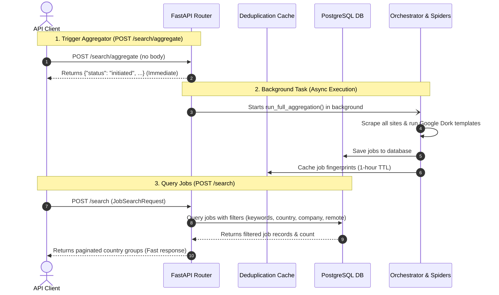

# Job Board Scraping & Aggregation Engine — API Reference

This document provides a detailed reference for all API endpoints exposed by the **Job Board Scraping & Aggregation Engine**.

---

## Interactive Documentation (Swagger UI)

When the backend container is running, the interactive OpenAPI specification and Swagger UI are accessible at:
* **Swagger UI:** [http://localhost:8000/docs](http://localhost:8000/docs)
* **ReDoc:** [http://localhost:8000/redoc](http://localhost:8000/redoc)

All request parameters, validation rules, examples, and response schemas are declared natively via Pydantic v2 metadata and are automatically rendered by the Swagger interface.

---

## Search & Aggregation Flow

The following sequence illustrates the caching and database-retrieval pipeline executed:



---

## API Endpoints Reference

### 1. Trigger Aggregate Scraping (Background Task)
* **Endpoint:** `POST /search/aggregate`
* **Summary:** Trigger Background Aggregation Process.
* **Description:** Initiates asynchronous background tasks to crawl and scrape jobs from all registered job sites and execute the Google search templates. The results are saved to the PostgreSQL database and cached for 1 hour. No input payload is required.

#### Request Body
None.

#### Response (`dict[str, str]`)
```json
{
  "status": "initiated",
  "message": "Aggregation process started in the background."
}
```

---

### 2. Search Aggregated Jobs
* **Endpoint:** `POST /search`
* **Summary:** Search Aggregated Jobs.
* **Description:** Retrieves and filters aggregated job listings directly from the database. The results are grouped by country and job board, and sorted within each board by date (newest first).
* **Behavior for Optional Fields**:
  - `limit` (default 50) and `offset` (default 0) are the only non-optional fields.
  - `keywords`, `country`, `company`, and `remote` are fully optional.
  - `keywords` (when provided as a list of strings) matches job listings containing **any** of the specified terms (using `OR` logic).
  - If `country` is omitted or `null`, jobs from **all countries** are returned and grouped dynamically.
  - If `remote` is omitted or `null`, **all job types** (remote, onsite, and hybrid) are returned without filtering.

#### Request Body (`JobSearchRequest`)
```json
{
  "keywords": ["engineer", "python"],
  "country": null,
  "company": "Google",
  "remote": null,
  "limit": 50,
  "offset": 0
}
```

#### Response (`PaginatedSearchResponse`)
```json
{
  "total": 12,
  "limit": 50,
  "offset": 0,
  "results": [
    {
      "country": "Egypt",
      "job_boards": [
        {
          "name": "linkedin",
          "jobs": [
            {
              "id": "2d1bc023de6143c08ec2027e1f7c5e2d",
              "title": "Senior Python Engineer (Remote)",
              "company": "Google",
              "url": "https://www.linkedin.com/jobs/view/123456789",
              "description": "Looking for a seasoned backend engineer experienced in FastAPI...",
              "location": "Cairo, Egypt",
              "salary": "$80,000 - $100,000 / year",
              "source": "linkedin_eg",
              "site": "linkedin_eg",
              "tags": ["Python", "FastAPI"],
              "scraped_at": "2026-06-03T00:10:00Z"
            }
          ]
        }
      ]
    },
    {
      "country": "Germany",
      "job_boards": [
        {
          "name": "indeed",
          "jobs": [
            {
              "id": "abc7b2d56a31c12e8ec0127e1f7c9aef",
              "title": "Python Developer (Onsite)",
              "company": "Google",
              "url": "https://de.indeed.com/viewjob?jk=123",
              "description": "Building cloud infrastructure at scale...",
              "location": "Munich, Germany",
              "salary": "N/A",
              "source": "indeed_germany",
              "site": "indeed_germany",
              "tags": ["Python", "Cloud"],
              "scraped_at": "2026-06-03T00:15:00Z"
            }
          ]
        }
      ]
    }
  ]
}
```

---

### 3. Orchestrated Live Scrapers
* **Endpoint:** `POST /search/orchestrate`
* **Summary:** Orchestrate Spiders & Google Search.
* **Description:** Runs concurrent, country-specific Playwright spiders (e.g. `linkedin_eg`, `indeed_sa`) and Google Search dorks in parallel, returning results nested by crawler source.

#### Response Schema (`dict[str, list[dict]]`)
```json
{
  "linkedin": [
    {
      "title": "Systems Engineer",
      "company": "Global Corp",
      "url": "https://www.linkedin.com/jobs/view/999",
      "description": "Kubernetes and AWS backend automation...",
      "location": "Cairo, Egypt",
      "salary": "N/A"
    }
  ],
  "indeed": [],
  "google": []
}
```

---

### 4. Legacy JobSpy Router
* **Endpoint:** `POST /search/jobspy`
* **Summary:** Legacy JobSpy Search Compatibility Route.
* **Description:** Backward-compatibility route serving flat results specifically from LinkedIn and Indeed. Bypasses general Google search results.

---

### 5. Dork Query Preview
* **Endpoint:** `GET /queries/preview`
* **Summary:** Preview Query Dorks.
* **Description:** Builds and displays the raw list of Google Search Dork queries that would be run for given criteria, without executing them. Great for dry-testing search scopes.

#### Query Parameters
* `keywords` (str): Comma-separated search terms. (Default: `"devops,kubernetes,terraform"`)
* `sites` (str): Comma-separated domains to search. (Default: `"linkedin.com/jobs,weworkremotely.com,greenhouse.io,lever.co"`)
* `location` (str): Onsite location or remote filter. (Default: `"remote"`)
* `countries` (str): Target countries. (Default: `"egypt,mena,eu,usa,canada"`)
* `days_back` (int): Number of days back. (Default: `1`)

#### Response
```json
{
  "queries": [
    "site:linkedin.com/jobs \"devops\" \"remote\" after:2026-06-01",
    "site:weworkremotely.com \"devops\" after:2026-06-01"
  ],
  "count": 2
}
```

---

### 6. Batch Google Search
* **Endpoint:** `POST /batch-search`
* **Summary:** Batch Google Search.
* **Description:** Runs raw list of custom Google search queries in parallel, parses, and returns the unified list of job items.

---

### 7. Cache Management
* **DELETE `/cache`**: Flushes all cached query fingerprints and URL deduplication history from the Redis or in-memory cache.
* **GET `/cache/stats`**: Returns statistics such as the count of tracked URLs and the oldest timestamp.

---

## Detailed Use Cases: Remote vs Onsite Jobs

The job scraping engine adapts its routing and search dork templates based on whether the query represents a **Remote** or **Onsite** job search.

### Use Case A: Remote Jobs (Global/Virtual)
To search for virtual remote roles, configure the `SearchRequest` with `work_type="remote"` and `location="remote"`. 

> [!NOTE]
> When `work_type="remote"` is specified, the orchestrator spawns **all** available regional spiders (e.g. Egypt, Saudi Arabia, UAE, Germany, Poland, Spain, Canada) to fetch international remote opportunities, and configures the Google Search dork templates with the `"remote"` keyword.

#### Request Example
```json
{
  "keywords": ["DevOps", "Kubernetes", "Golang"],
  "work_type": "remote",
  "location": "remote",
  "countries": ["egypt", "Germany", "usa"],
  "days_back": 3,
  "max_results": 40
}
```

---

### Use Case B: Onsite Jobs (Location-Specific)
To search for physical jobs in a specific city/country, configure `work_type="onsite"` (or `None`), provide the target `location` name, and specify the primary country in `countries`.

> [!IMPORTANT]
> The engine optimizes resource usage by routing the request **only** to regional spiders matching the target location and country.
> For example:
> * If location is `"Cairo"` and country is `"egypt"`, the orchestrator executes **only** `linkedin_eg` and `indeed_eg`.
> * If location is `"Riyadh"` and country is `"saudi"`, the orchestrator executes **only** `linkedin_sa` and `indeed_sa`.
> * Other regional spiders are ignored.
> * The Google Search templates will scope the location keywords (e.g., `"Cairo"`) instead of `"remote"`.

#### Request Example (Onsite Cairo, Egypt)
```json
{
  "keywords": ["Python", "FastAPI"],
  "work_type": "onsite",
  "location": "Cairo",
  "countries": ["egypt"],
  "days_back": 7,
  "max_results": 20
}
```
