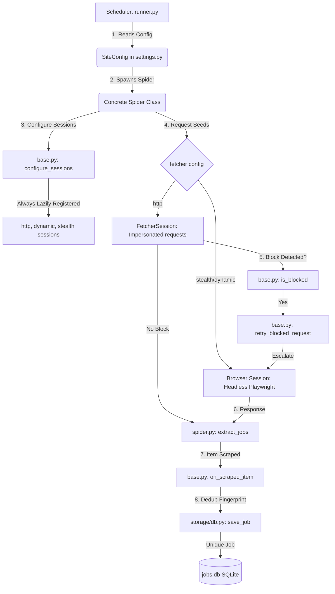

# Job Board Scraping Engine

A production-grade, highly optimized, and adaptive job board scraping framework built on **[Scrapling](https://scrapling.readthedocs.io)**. The engine features automatic anti-bot session escalation, Cloudflare turnstile bypass, headless browser pooling, SQLite data persistence, and native JSON API integrations.

---

## Architecture Overview

```
job_scraper_engine/
├── config/
│   └── settings.py          ← SiteConfig registry & scheduler parameters
├── spiders/
│   ├── base.py              ← BaseJobSpider (shared session, retry, block & deduplication engine)
│   └── job_spiders.py       ← Concrete spider classes implementing extract_jobs()
├── storage/
│   └── db.py                ← SQLite persistence, deduplication and run tracking
├── scheduler/
│   └── runner.py            ← Runner command line interface & hourly cron loop
├── logs/                    ← Auto-created runtime log files
├── crawl_checkpoints/       ← Playwright pause/resume queues (per spider)
├── jobs.db                  ← SQLite database (auto-created)
└── requirements.txt
```

### Scraping Pipeline & Data Flow



---

## Anti-Bot & Intelligent Escalation Pipeline

The engine utilizes Scrapling's high-speed TLS/JA3 impersonation for standard HTTP requests. If a request is blocked, the engine dynamically escalates the request session:

```
FetcherSession (Fast HTTP)  ──►  AsyncDynamicSession (Playwright Chrome)  ──►  AsyncStealthySession (Fingerprint spoofed + Turnstile bypass)
```

> [!NOTE]
> All browser sessions are registered **lazily** (`lazy=True`). Playwright Chromium browser instances are never started unless a spider's initial `fetcher` is set to browser mode or an HTTP block occurs, saving significant system resources.

---

## Step-by-Step Guide: Adding a New Job Board

To add support for a new job board, you only need to update three parts of the codebase: the settings config, the spider logic, and the spider registry.

### Step 1: Add a `SiteConfig` in `config/settings.py`

Declare the metadata, target URLs, and scraping strategy in `SITES` inside `config/settings.py` (and its root counterpart `settings.py`):

```python
SiteConfig(
    name="myboard",                                         # Unique identifier (lowercase, slugified)
    start_urls=["https://myboard.com/remote-jobs"],         # Entrypoint URL(s) or API endpoints
    fetcher="http",                                         # "http" | "dynamic" | "stealth"
    download_delay=2.0,                                     # Crawl delay in seconds
    max_pages=5,                                            # Pagination safety cap (0 = unlimited)
    next_page_selector="a.next-page::attr(href)",           # CSS selector for next-page buttons
    robots_txt_obey=True,                                   # Respect robots.txt (set False for public developer APIs)
    extra_fetch_kwargs={"network_idle": True},              # Optional extra Playwright settings
),
```

> [!TIP]
> **API vs HTML Strategy:** Always check if the website has a public JSON API or RSS feed (e.g., `/api/...` or `/feed`). Scraping JSON APIs using `fetcher="http"` is 100x faster, perfectly structured, and completely immune to HTML changes and browser blocking. If an API endpoint exists, set `fetcher="http"` and `robots_txt_obey=False` if `/api/` is blocked in their robots.txt (since they publish the API for developers to query).

---

### Step 2: Implement the Spider Class in `spiders/job_spiders.py`

Create a new spider class in `spiders/job_spiders.py` (and root `job_spiders.py`) inheriting from `BaseJobSpider`. The spider only needs to implement the `extract_jobs` async generator.

We recommend a **hybrid/defensive parsing strategy** which natively parses clean JSON API payloads when available, while seamlessly falling back to HTML CSS selector parsing.

```python
class MyBoardSpider(BaseJobSpider):
    site_config = _cfg("myboard")  # Binds the spider to its SiteConfig metadata

    async def extract_jobs(self, response: Response):
        """
        Extracts jobs from the response. Supports JSON API payload parsing 
        with automatic HTML CSS scraping fallback.
        """
        # ─── Strategy A: JSON API Parsing (Highly Recommended) ───
        try:
            import json
            data = json.loads(response.body)
            if isinstance(data, dict) and "jobs" in data:
                for job in data.get("jobs", []):
                    title = job.get("jobTitle", "").strip()
                    company = job.get("companyName", "").strip()
                    location = job.get("jobGeo", "Remote").strip()
                    url = job.get("url", "").strip()
                    tags = job.get("tags", [])
                    salary = job.get("salary", "").strip()

                    if title and url:
                        yield {
                            "title":    title,
                            "company":  company,
                            "location": location,
                            "url":      url,
                            "tags":     tags,
                            "salary":   salary,
                        }
                return  # Parsing completed successfully via API
        except Exception:
            pass  # Fallback to HTML parsing if response is HTML or JSON parsing fails

        # ─── Strategy B: HTML CSS Selector Parsing (Fallback) ───
        for card in response.css("a.job-card-link, div.job-listing-container"):
            title    = card.css("h2.title::text, .job-title::text").get("").strip()
            company  = card.css(".company-name::text").get("").strip()
            location = card.css(".job-location::text").get("Remote").strip()
            url = card.css("a::attr(href), a.job-link::attr(href)").get("").strip()
            tags     = card.css(".tag::text").getall()
            salary   = card.css(".salary-info::text").get("").strip()

            # Clean up potential duplicate whitespace/newlines in parsed text
            company = " ".join(company.split())
            location = " ".join(location.split())

            if title and url:
                if url.startswith("/"):
                    url = f"https://myboard.com{url}"
                yield {
                    "title":    title,
                    "company":  company,
                    "location": location,
                    "url":      url,
                    "tags":     tags,
                    "salary":   salary,
                }
```

#### Fields to Extract
Every yielded job dictionary **must** map to the following schema keys:

| Key | Type | Description | Required | Example |
|---|---|---|---|---|
| `title` | `str` | Job position title | **Yes** | `"Senior Software Engineer"` |
| `company` | `str` | Company hiring | **Yes** | `"Acme Corp"` |
| `location` | `str` | Region, timezone, or country | **Yes** | `"USA | Remote"` |
| `url` | `str` | Direct link to the job posting (absolute URL) | **Yes** | `"https://myboard.com/jobs/senior-dev"` |
| `tags` | `list[str]` | Stack, industry categories, or work terms | No | `["Python", "Full-Time"]` |
| `salary` | `str` | Annual compensation or hourly rate | No | `"$120,000 - $140,000"` |

---

### Step 3: Register the Spider Class

Add your new spider class to the `ALL_SPIDERS` registry mapping at the bottom of `spiders/job_spiders.py` (and root `job_spiders.py`):

```python
ALL_SPIDERS: dict[str, type[BaseJobSpider]] = {
    "remoteok":         RemoteOKSpider,
    "weworkremotely":   WeWorkRemotelySpider,
    "jobicy":           JobicySpider,
    "remotive":         RemotiveSpider,
    "himalayas":        HimalayasSpider,
    "myboard":          MyBoardSpider,  # ← Register your new spider here
}
```

---

## Testing & Debugging Your New Spider

#### 1. Dry-Run a Single Site
Execute a single run of your new spider to verify that requests execute cleanly, bypass WAFs, and extract jobs correctly:

```bash
cd job_scraper_engine
python3 -m scheduler.runner --once --site myboard
```

#### 2. Check Execution Statistics
The terminal output and the `logs/scheduler.log` file will summarize the scraping stats. Pay attention to:
*   `blocked_requests_count` — Should be `0` under normal operation.
*   `failed_requests_count` — Should be `0` (no timeouts or socket errors).
*   `items_scraped` — The number of parsed jobs. Should match the active postings count on the board.

#### 3. Inspect Saved Listings
Query the SQLite database (`jobs.db`) directly to verify the saved fields:

```bash
sqlite3 jobs.db "SELECT source, title, company, location FROM jobs WHERE source='myboard' LIMIT 5;"
```

---

## Troubleshooting

> [!WARNING]
> **Issue: Falsely Flagged Blocks (Escalation Loop)**
> 
> If a spider immediately triggers an escalation (`http → dynamic → stealth`) even though the response succeeds (returns 200), check `is_blocked` in `base.py`. 
> 
> Generic signals in standard HTML (like a CSS class called `"blocked"` or javascript libraries imported from `cdnjs.cloudflare.com`) can cause false positives. Our block-detection logic is optimized to scan page titles (`<title>`) for actual block notices (e.g. `"Just a moment..."`, `"Access Denied"`) and restrict body scans to specific signatures (`"cloudflare ray id"`, `"ddos-guard"`). Adjust the block signature list in `is_blocked()` as needed.

> [!CAUTION]
> **Issue: Browser Session Timeouts**
> 
> Heavy javascript pages can take time to load completely. If a Playwright dynamic/stealth session times out after 30 seconds (`Timeout 30000ms exceeded`), the session configuration will automatically escalate to 60 seconds (`timeout=60000`) and use Scrapling's turnstile captcha solving. Ensure that `network_idle` is used sparingly or the timeout limit is extended to allow asynchronous scripts to render.
